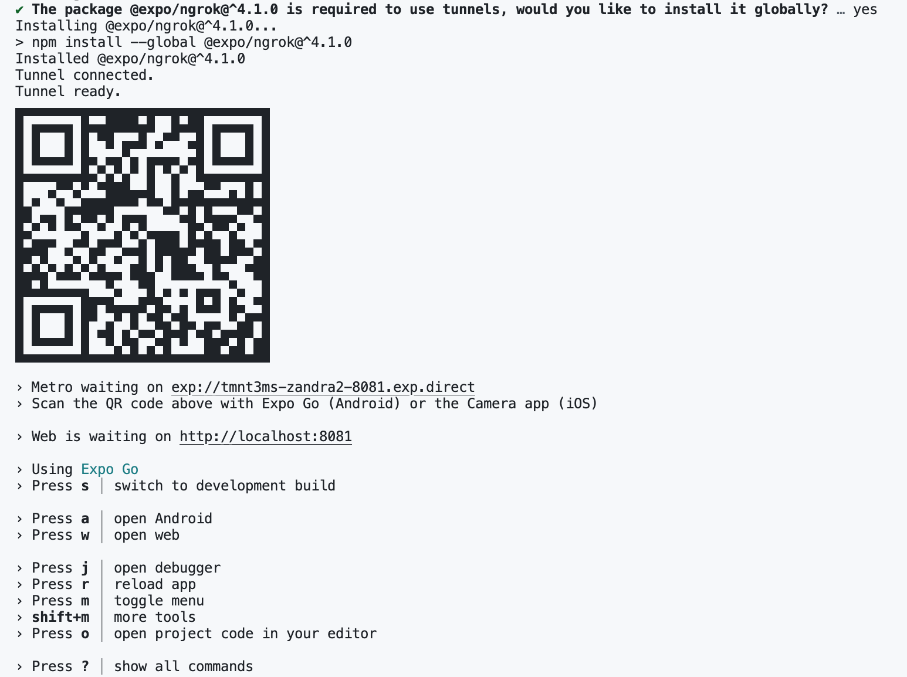

# MindBloom
MindBloom offers a clean and calming user experience that encourages mental well-being through daily affirmations, guided breathing exercises, and mindfulness session logging.

There are three main features: 
- Home screen displaying an inspirational quote
- Breathing timer screen with animations
- Log screen for tracking mindfulness sessions

### 1. Getting Started with Codespace
1. Create a Github repo

2. Select the _"code"_ button from the tab and from the dropdown menu select Codespaces to create codespace on main.

3. In the terminal run to create the mobile app:
```
npx create-expo-app YourMobileAppName
```
4. CD into the newly created YourMobileAppName directory from the terminal.

5. Connect your Expo credentials run:
```
npx expo login
```

Note: 
- You must have an Expo account. If you do not have an Expo account; you can create one here [Expo](https://expo.dev/signup). 

- When prompted, enter the Expo login information, e.g. username and password

6. Add your code. Once satisfied. To start up your app, run:
```
npx expo start --tunnel
```
OR
```
npm run web
```

Note: 
- Use a **_tunnel_** connection (via Expo servers), allowing your mobile device to connect even if it’s on a different Wi-Fi or cellular network.

- If it asks to install @expo/ngrok@^4.1.0, type **_"y"_** for yes.

7. Open [localhost](http://localhost:8081) to view it in your browser, scan the QR code or manually type the [url](https://tmnt3ms-zandra2-8081.exp.direct/) onto your mobile device.



Note: 
- To view the mobile app on your device you need to install **_Expo Go_** onto your phone first to be able to use the following feature. 

- To view the app on the browser type **_"w"_** on your terminal. -To view the app on a mobile device scan the QR code or manually type the given exp link.

8. To exit the application run,
```
control + c
```

*********

# Additional Information

## Welcome to your Expo app 👋

This is an [Expo](https://expo.dev) project created with [`create-expo-app`](https://www.npmjs.com/package/create-expo-app).

### Get started

1. Install dependencies

   ```bash
   npm install
   ```

2. Start the app

   ```bash
    npx expo start
   ```

In the output, you'll find options to open the app in a

- [development build](https://docs.expo.dev/develop/development-builds/introduction/)
- [Android emulator](https://docs.expo.dev/workflow/android-studio-emulator/)
- [iOS simulator](https://docs.expo.dev/workflow/ios-simulator/)
- [Expo Go](https://expo.dev/go), a limited sandbox for trying out app development with Expo

You can start developing by editing the files inside the **app** directory. This project uses [file-based routing](https://docs.expo.dev/router/introduction).

### Get a fresh project

When you're ready, run:

```bash
npm run reset-project
```

This command will move the starter code to the **app-example** directory and create a blank **app** directory where you can start developing.

### Learn more

To learn more about developing your project with Expo, look at the following resources:

- [Expo documentation](https://docs.expo.dev/): Learn fundamentals, or go into advanced topics with our [guides](https://docs.expo.dev/guides).
- [Learn Expo tutorial](https://docs.expo.dev/tutorial/introduction/): Follow a step-by-step tutorial where you'll create a project that runs on Android, iOS, and the web.

### Join the community

Join our community of developers creating universal apps.

- [Expo on GitHub](https://github.com/expo/expo): View our open source platform and contribute.
- [Discord community](https://chat.expo.dev): Chat with Expo users and ask questions.
